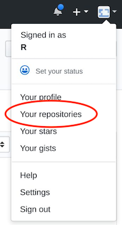
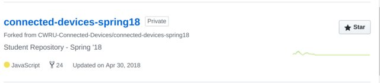
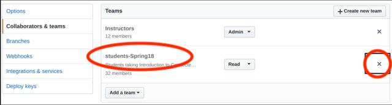

# GitHub Permissions

By default, your [fork](https://help.github.com/articles/fork-a-repo/) of the instructor's repo (short for repository) will be viewable by all members of your team.  Since your team includes all of the other students taking the course, this can create opportunities that tempt students to compromise their academic integrity.

To avoid this, you will need to change the permissions on your repo fork.

Follow these steps:

1. Navigate to and Sign in to your account
[github](https://github.com/) 
1. Under your profile, navigate to "Your Repositories"

1. Select your fork of the Connected Devices Repository  (e.g., `connected-devices-spring18`, `connected-devices-spring19`, etc.)

1. Click on settings (far right)

1. On the Settings page, select "Collaborators and Teams" on the Left, and click on "X" next to any team _other_ than **instructors** to remove permissions for that team (e.g., **students-spring18**)

1. DO NOT change permissions for **Instructors** as doing so will prevent your assignments from being graded.

&copy; 2015-19 LeanDog, Inc. and Nick Barendt